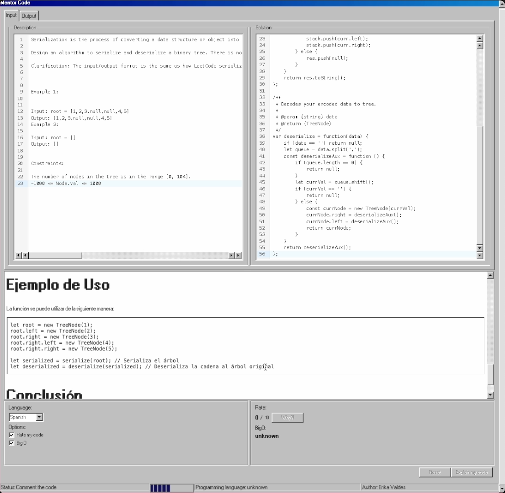

# MyCodeMentorApp

This mentor code application, developed using Angular, connects to a WebSocket service. You can find the server [here](https://github.com/envm92/mentor-code-openai-nodejs). The purpose of this application is to explain a coding solution by providing a description.

This project was generated with [Angular CLI](https://github.com/angular/angular-cli) version 18.1.2.

## Development server

Run `ng serve` for a dev server. Navigate to `http://localhost:4200/`. The application will automatically reload if you change any of the source files.

## Styling with 98.css

I've used the [98.css](https://github.com/jdan/98.css) library to style my project. It provides a nostalgic Windows 98 aesthetic. Check it out!
